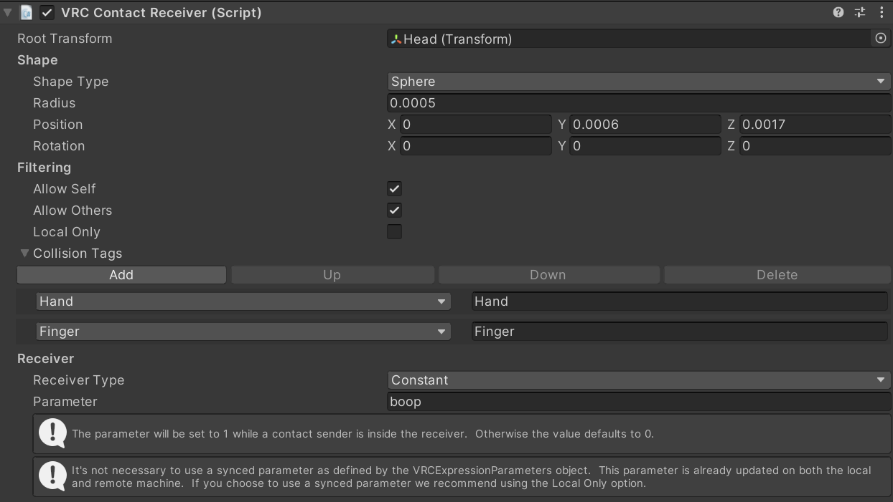
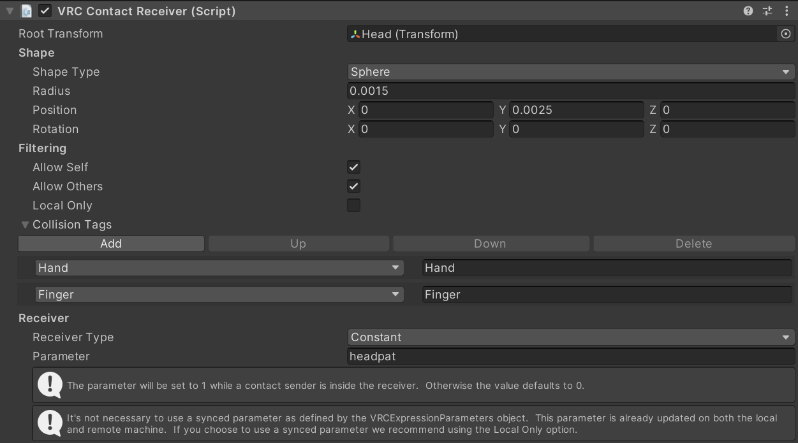

# Chatbox OSC Scripts
Got inspired by [Cyberkitsune's vrc-osc-scripts](https://github.com/cyberkitsune/vrc-osc-scripts) 
and decided to make something on my own

## VRCInteractionCounter
This script counts, saves and displays the number of times an avatar parameter has been changed.

### How to use

Change the `config.json` file and put the avatar parameters the changes of which you want to count 
and the format of text that displays in the chatbox upon the interaction. 

### Example
Imagine there are 2 interactions that need to be counted: boops and headpats. 
The avatar has 2 contact receivers which change 2 boolean parameters inside the animation controller:



The `config.json` file for these parameter names can look like this:
```
{
    "interactions": {
        "boop": {
            "count": 0,
            "text_format": "Boops: {count}"
        },
        "headpat": {
            "count": 0,
            "text_format": "Headpats: {count}"
        }
    },
    "receiving_port": 9001,
    "sending_port": 9000
}
```
In this case, it will display `Boops: 1`, `Boops: 2` and so on in the chatbox when booped and 
`Headpats: 1`, `Headpats: 2` when headpatted.

### How to run in the background

Just run the `silent_run.vbs` script, and it will continue working without any visible windows.

To launch on startup, create a shortcut to `silent_run.vbs` and put it inside 
`C:\Users\[Your user name]\AppData\Roaming\Microsoft\Windows\Start Menu\Programs\Startup`

### Chatbox cooldown
Because if too many messages are sent to the chatbox, it stops working, 
I made the chatbox display have a cooldown of 1.5 seconds. 
The actual counting doesn't have any cooldowns so there's no speed limit to how fast you can be booped.

# SmallEducationalExamples
This is a compilation of small VRC OSC python scripts to show how to work with it.