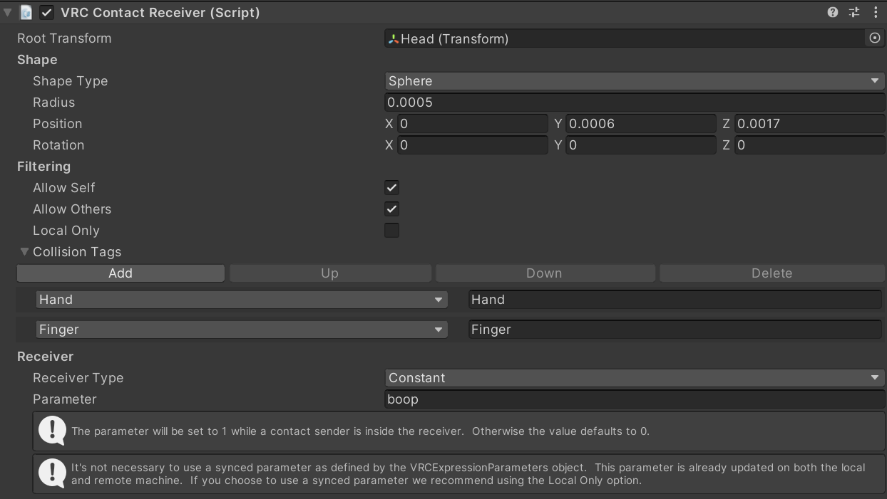
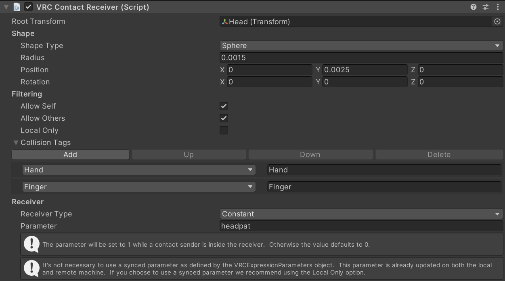

# Chatbox OSC Scripts
Got inspired by [Cyberkitsune's vrc-osc-scripts](https://github.com/cyberkitsune/vrc-osc-scripts) 
and decided to make something on my own

## VRCInteractionCounter

### What does it do?
This script counts, saves and displays in the chatbox the number of times an avatar parameter has been changed 
(being touched/interacted with/etc).

### How to use
0) Install the requirements with `pip3 install -r requirements.txt`
1) Change the `config.json` file and put the avatar parameters the changes of which you want to count 
and the format of text that displays in the chatbox upon the interaction. 
2) Launch `interaction_counter.py`

### How to run in the background

Just run the `silent_run.vbs` script, and it will continue working without any visible windows.

To launch on startup, create a shortcut to `silent_run.vbs` and put it inside 
`C:\Users\[Your user name]\AppData\Roaming\Microsoft\Windows\Start Menu\Programs\Startup`

To close the program - find it in the task manager and kill it.

### Chatbox cooldown
If the messages are sent to the chatbox too quickly, it will stop working.  
To combat this a ratelimit of a message every 1.5 seconds is applied.   
The actual counting doesn't have any cooldowns so there's no speed limit to how fast you can be booped.

### Configuration

The `config.json` file stores which parameters to track and the saved amount of activations:
```
{
    "interactions": {
        "some_avatar_parameter": {
            "count": 239,
            "text_format": "Some avatar parameter has been set to 1 {count} times"
        },
        "another_avatar_parameter": {
            "count": 42,
            "text_format": "Another avatar parameter activations: {count}"
        }
    },
    "receiving_port": 9001,
    "sending_port": 9000
}
```
The avatar parameter names are stored inside the `interactions` section. Each parameter has a `count` - 
the amount of times it has been activated so far, and a `text_format` - the text which gets displayed in the chatbox.
The text in `text_format` has to have `{count}` in the place where you want to have the counted number to appear.

`sending_port` and `receiving_port` are ports which the program uses for OSC. VRChat uses ports `9000` and `9001`
for OSC.

See working example [here](./VRCInteractionCounter/config.json)

### Avatar parameter types

A parameter change counts as an activation if it gets set to 1 (true) and wasn't 1 before that moment.  
This program works best with boolean avatar parameters because VRChat OSC sends a lot of messages if a float parameter
gets changed and I haven't found a reliable way to determine what counts as an activation for float parameters.


### Example
Imagine there are 2 interactions that need to be counted: boops and headpats.  
The avatar has 2 contact receivers which change 2 boolean parameters inside the animation controller:  



The `config.json` file for these parameter names can look like this:
```
{
    "interactions": {
        "boop": {
            "count": 0,
            "text_format": "Boops: {count}"
        },
        "headpat": {
            "count": 0,
            "text_format": "Headpats: {count}"
        }
    },
    "receiving_port": 9001,
    "sending_port": 9000
}
```
In this case, it will display `Boops: 1`, `Boops: 2` and so on in the chatbox when booped and 
`Headpats: 1`, `Headpats: 2` when headpatted.

# SmallEducationalExamples
This is a compilation of small VRC OSC python scripts to show how to work with it.